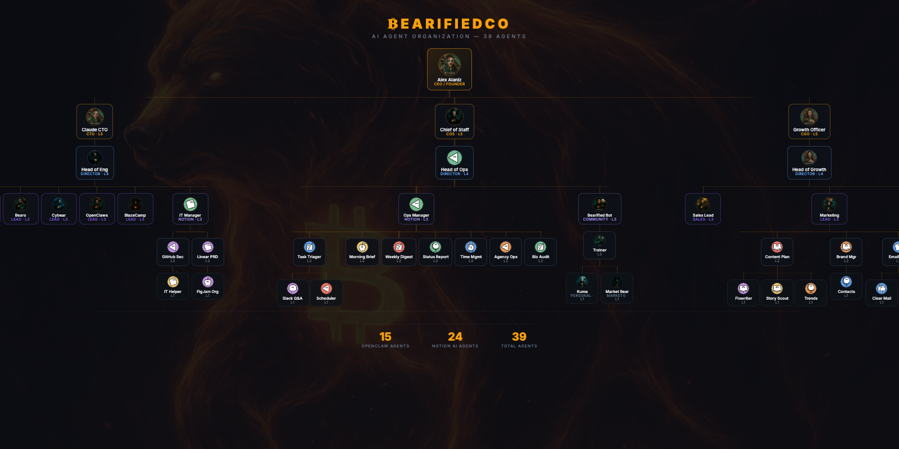

---

### About

I build products and ship them. Currently running **Bearified** where an AI org of 39 autonomous agents builds, sells, and grows our products around the clock on a single Mac mini M4 Pro.

- Building **agentic payments** infrastructure so AI agents can transact autonomously
- Running a **39-agent AI org** managed by an AI CTO + Head of Engineering
- Former dev who decided to build the whole company with AI instead of just the code
- Based in NYC / NJ

---

### Products

| Product | What It Does | Stack |
|---------|-------------|-------|
| [**Bearo**](https://bearo.cash) | Agentic P2P payments (Venmo for AI agents) | React Native, Expo, thirdweb, Supabase |
| [**OpenClaws**](https://openclaws.biz) | 24/7 AI assistant, $29/mo | OpenClaw, Multi-channel |
| [**BearCrawl**](https://bearcrawl.ai) | AI agent platform, 5 tiers | Next.js, BYOAuth |
| [**Chimpanion**](https://apps.apple.com) | AI companion (App Store live) | Swift, iOS native |
| [**Storefront**](https://github.com/Alex-Alaniz/storefront) | B2B/B2C mobile commerce | SwiftUI, Swift Package |

---

### Tech Stack

---

### The AI Org

**39 total agents. Zero human employees. Shipping daily.**

---

### GitHub Stats

---

### Snake

<picture>
  <source media="(prefers-color-scheme: dark)" srcset="https://raw.githubusercontent.com/Alex-Alaniz/Alex-Alaniz/output/github-snake-dark.svg" />
  <source media="(prefers-color-scheme: light)" srcset="https://raw.githubusercontent.com/Alex-Alaniz/Alex-Alaniz/output/github-snake.svg" />
  
</picture>

---

**[bearo.cash](https://bearo.cash)** | **[openclaws.biz](https://openclaws.biz)** | **[bearcrawl.ai](https://bearcrawl.ai)**

*Building in public. Shipping with AI. Every single day.*

